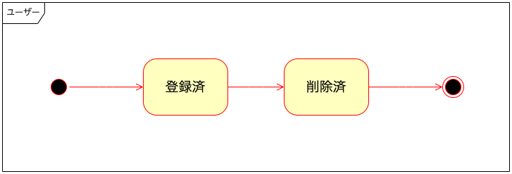
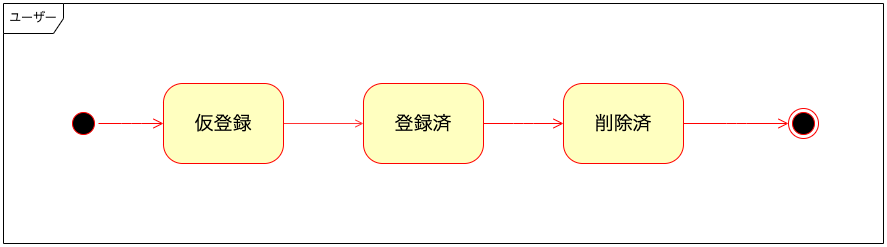

## 論理削除をやめて状態遷移で管理した方がいいかも

ひがき

@higaki_program

---

論理削除について勉強したので、

誰かの役に立てばと思いまとめてみる

感想・誤り等ありましたら、ご連絡いただけます嬉しいです！

twitter

@higaki_program

---

### 参考

[27. 論理削除とは何か？どのような解法があるのか？ w/ twada](https://fukabori.fm/episode/27)

[失敗から学ぶRDBの正しい歩き方 (Software Design plus)](https://www.amazon.co.jp/%E5%A4%B1%E6%95%97%E3%81%8B%E3%82%89%E5%AD%A6%E3%81%B6RDB%E3%81%AE%E6%AD%A3%E3%81%97%E3%81%84%E6%AD%A9%E3%81%8D%E6%96%B9-Software-Design-plus-%E6%9B%BD%E6%A0%B9/dp/4297104083/ref=d_pd_vtp_sccl_2_10/356-9914192-9182259?pd_rd_w=bIg6d&content-id=amzn1.sym.cbb45385-7b99-44b7-a528-bff5ddaa153d&pf_rd_p=cbb45385-7b99-44b7-a528-bff5ddaa153d&pf_rd_r=G7TCNGTHE5808Y3KBS2B&pd_rd_wg=j9imZ&pd_rd_r=f7a933bf-707a-47dd-a11a-a0be4cc51e2d&pd_rd_i=4297104083&psc=1)

[達人に学ぶDB設計 徹底指南書 初級者で終わりたくないあなたへ](https://www.amazon.co.jp/%E9%81%94%E4%BA%BA%E3%81%AB%E5%AD%A6%E3%81%B6DB%E8%A8%AD%E8%A8%88-%E5%BE%B9%E5%BA%95%E6%8C%87%E5%8D%97%E6%9B%B8-%E5%88%9D%E7%B4%9A%E8%80%85%E3%81%A7%E7%B5%82%E3%82%8F%E3%82%8A%E3%81%9F%E3%81%8F%E3%81%AA%E3%81%84%E3%81%82%E3%81%AA%E3%81%9F%E3%81%B8-%E3%83%9F%E3%83%83%E3%82%AF/dp/4798124702/ref=pd_lpo_1?pd_rd_w=BQigu&content-id=amzn1.sym.d769922e-188a-40cc-a180-3315f856e8d6&pf_rd_p=d769922e-188a-40cc-a180-3315f856e8d6&pf_rd_r=JFJZQ2AQ69AVR0ZJ607N&pd_rd_wg=1lQwh&pd_rd_r=fdefdcb0-cb36-4a7b-a955-4fb459739d46&pd_rd_i=4798124702&psc=1)

---

### LT内の論理削除

  削除フラグを用いて、あるレコードを削除したことにする

---

### 具体例で考えてみよう

ユーザーは以下の状態を持つ

  <ul>
    <li>登録済</li>
    <li>削除済</li>
  </ul>

---

### 論理削除はやめた方が良いかも

論理削除は実装が簡単だから、ついつい手を出してしまいがちだが、

個人的にはおすすめできない

| id | name | email | created_at | updated_at | is_deleted |
| --- | --- | --- | --- | --- | --- |
| 1 | 檜垣 | higaki@example.com | 2022-12-01 12:00:00 | 2022-12-01 12:00:00 | 0 |
| 2 | 佐藤 | sato@example.com | 2022-12-01 12:00:00 | 2022-12-01 12:00:00 | 0 |
| 3 | 本村 | motomura@example.com | 2022-12-01 12:00:00 | 2022-12-01 12:00:00 | 1 |

--

### メリット

  <ul>
    <li>実装が楽</li>
  </ul>

--

### デメリット

  <ul>
    <li>1カラムに削除済かどうかの情報しかない</li>
    <li>SQLに「削除フラグ=0」が必要になる</li>
    <li>unique制約に削除フラグを含める必要がある</li>
    <li>デフォルトで「削除フラグ=0」を含む設定にする場合、「削除フラグ=1」を検索したい場合に少し複雑になる</li>
  </ul>

--

#### こんな場合は使用してもいいかも

  <ul>
    <li>削除された時間は必要ない</li>
    <li>削除されるレコードが少なく、検索スピードにあまり影響しない</li>
    <li>扱うモデルの状態がシンプル</li>
    <li>特別な事情あり</li>
  </ul>

---

### （代替案１）削除日時にする（おすすめでない）

昔のORMでは主流の実装だったみたい。

例）

デフォルトを9999年1月1日12時0分0秒にして、削除処理が行われた時間に更新する。

| id | name | email | created_at | updated_at | deleted_at |
| --- | --- | --- | --- | --- | --- |
| 1 | 檜垣 | higaki@example.com | 2022-12-01 12:00:00 | 2022-12-01 12:00:00 | 9999-01-01 12:00:00 |
| 2 | 佐藤 | sato@example.com | 2022-12-01 12:00:00 | 2022-12-01 12:00:00 | 9999-01-01 12:00:00 |
| 3 | 本村 | motomura@example.com | 2022-12-01 12:00:00 | 2022-12-01 12:00:00 | 2022-11-12 14:12:54 |

削除：deleted_at < 現在時刻

Not削除：現在時刻 < deleted_at

--

  ORM例
| 言語 | ORM |
| --- | --- |
| Ruby | ActiveRecord |
| PHP | Eloquent |

--

### メリット

  <ul>
    <li>ORMを使用すれば実装が楽</li>
  </ul>

--

### デメリット

  <ul>
    <li>1カラムに削除された時間の情報しかない</li>
    <li>SQLに「現在時刻 < deleted_at」が必要になる</li>
    <li>unique制約に削除日時を含める必要がある</li>
    <li>デフォルトで「現在時刻 < deleted_at」を含む設定にする場合、「deleted_at < 現在時刻」を検索したい場合に少し複雑になる</li>
  </ul>

--

#### こんな場合は使用してもいいかも

  <ul>
    <li>削除されるレコードが少なく、検索スピードにあまり影響しない</li>
    <li>扱うモデルの状態がシンプル</li>
    <li>特別な事情あり</li>
  </ul>

---

### （代替案２）状態遷移でモデリングする。

ステートマシンライブラリを用いて

enum型 or varchar型の状態カラムを追加する。

| id | name | email | created_at | updated_at | state |
| --- | --- | --- | --- | --- | --- |
| 1 | 檜垣 | higaki@example.com | 2022-12-01 12:00:00 | 2022-12-01 12:00:00 | Registered |
| 2 | 佐藤 | sato@example.com | 2022-12-01 12:00:00 | 2022-12-01 12:00:00 | Registered |
| 3 | 本村 | motomura@example.com | 2022-12-01 12:00:00 | 2022-12-01 12:00:00 | Deleted |

PHP ステートマシンライブラリ

[A PHP5.3+ Finite State Machine](http://yohan.giarel.li/Finite/)

--

### メリット

  <ul>
    <li>ステートマシンライブラリを用いると実装が楽</li>
    <li>状態の追加が容易</li>
  </ul>

--

### デメリット

  <ul>
    <li>SQLに「状態 <> "Deleted"」等が必要になる</li>
    <li>デフォルトで「状態 <> "Deleted"」を含む設定にする場合、「状態 = "Deleted"」を検索したい場合に少し複雑になる</li>
  </ul>

--

#### こんな場合は使用してもいいかも

  <ul>
    <li>削除されるレコードが少なく、検索スピードにあまり影響しない</li>
    <li>扱うモデルの状態が複雑</li>
  </ul>

--

### 状態変化時

仮登録の状態が追加となる場合

| id | name | email | created_at | updated_at | state |
| --- | --- | --- | --- | --- | --- |
| 1 | 檜垣 | higaki@example.com | 2022-12-01 12:00:00 | 2022-12-01 12:00:00 | Registered |
| 2 | 佐藤 | sato@example.com | 2022-12-01 12:00:00 | 2022-12-01 12:00:00 | Temporary   Registered |
| 3 | 本村 | motomura@example.com | 2022-12-01 12:00:00 | 2022-12-01 12:00:00 | Deleted |

---

### （代替案３）履歴テーブルをトリガーで作成する。

userテーブルとdeleted_userテーブルが作成される

userテーブル

| id | name | email | created_at | updated_at |
| --- | --- | --- | --- | --- |
| 1 | 檜垣 | higaki@example.com | 2022-12-01 12:00:00 | 2022-12-01 12:00:00 |
| 2 | 佐藤 | sato@example.com | 2022-12-01 12:00:00 | 2022-12-01 12:00:00 |

deleted_userテーブル

| id | name | email | created_at | updated_at | deleted_at |
| --- | --- | --- | --- | --- | --- |
| 1 | 本村 | motomura@example.com | 2022-12-01 12:00:00 | 2022-12-01 12:00:00 | 2022-12-12 14:12:54 |

[MySQL Document(20.3 トリガーの使用)](https://dev.mysql.com/doc/refman/5.6/ja/trigger-syntax.html)

--

### メリット

  <ul>
    <li>削除済のDBが分かれているので検索が早い</li>
    <li>状態やフラグにインデックスを貼らなくてもよくなる</li>
  </ul>

--

### デメリット

  <ul>
    <li>テーブル数が増える</li>
    <li>外部キー制約を設定する場合、複数の削除済テーブルを作成する必要がある</li>
  </ul>

--

#### こんな場合は使用してもいいかも

  <ul>
    <li>削除されるレコードが多く、検索スピードに影響する</li>
    <li>テーブル数が多くなっても問題ない</li>
    <li>状態やフラグにテーブルに一つしか貼れないインデックスを取られたくない</li>
  </ul>

---

### （代替案４）更新も削除もしない

起こった事実のみをDBに格納していく。

| id | user_id | name | email | created_at | state |
| --- | --- | --- | --- | --- | --- | --- |
| 1 | 1 | 檜垣 | higaki@example.com | 2022-12-01 12:00:00 | Temporary   Registered |
| 2 | 1 | 檜垣 | higaki@example.com | 2022-12-10 12:00:00 | Registered |
| 3 | 1 | 檜垣 | higaki@example.com | 2022-12-20 12:00:00 | Deleted |
| 4 | 2 | 佐藤 | sato@example.com | 2022-12-01 12:00:00 | Temporary   Registered |
| 5 | 3 | 本村 | motomura@example.com | 2022-12-01 12:00:00 | Registered |

--

### メリット

  <ul>
    <li>更新や削除が行われないので、基本的にデータの改ざん・喪失を考えなくて良い</li>
  </ul>

--

### デメリット

  <ul>
    <li>膨大なデータになる</li>
    <li>常にorder byで最新の状態を取得する必要がある</li>
  </ul>

--

#### こんな場合は使用してもいいかも

  <ul>
    <li>使用するデータが膨大にならない</li>
    <li>データが膨大になる場合、お金で解決できる場合</li>
    <li>速度よりも堅牢さが重要なシステム</li>
  </ul>

---

### 「誤った操作を元に戻したい」要望があった場合

  <ul>
    <li>誤操作しにくい画面にしよう</li>
    <li>遅延レプリケーション</li>
  </ul>

